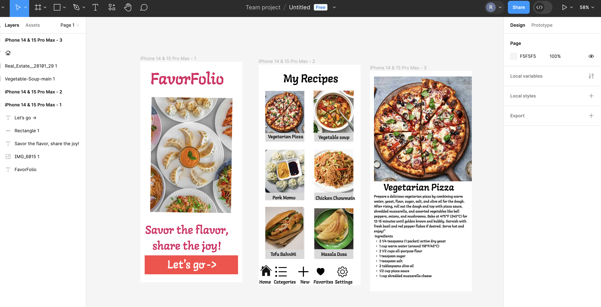

Overview
Description
A mobile application for storing, browsing, and organizing recipes. 

App Evaluation
[Evaluation of your app across the following attributes]

Category: Recipe management and culinary exploration.
Mobile: The app is designed for mobile devices, allowing users to access their recipes on the go and utilize features such as meal planning and shopping lists while grocery shopping or cooking in the kitchen.
Story: The app aims to provide users with a convenient and enjoyable way to discover, store, and share recipes, creating a personalized culinary experience tailored to their tastes and preferences.
Market: The market for recipe apps is competitive, but there is also a significant demand for high-quality apps that offer unique features and a seamless user experience. My app's success will depend on factors such as its usability, features, marketing strategy, and ability to differentiate itself from competitors.
Habit: Has the potential to become a habit for users who enjoy cooking and exploring new recipes regularly. F
Scope: The scope of my app includes features such as recipe storage, browsing, organization, meal planning, social sharing, and potentially additional features like cooking timers, nutritional information, and ingredient substitutions. 
Product Spec
1. User Stories (Required and Optional)
Required Must-have Stories
As an international student away from my family who loves to cook, I want to be able to easily browse and access a variety of family-friendly recipes on my phone, so I can plan meals ahead of time and make grocery shopping more efficient. I also want the ability to save my favorite recipes and share them with friends who have similar tastes. Additionally, having features like cooking timers and ingredient substitutions would be helpful when I'm in the kitchen with limited time and resources. Overall, I'm looking for an app that simplifies the meal planning process and inspires me to try new dishes while catering to my family's preferences and dietary needs."

...
Optional Nice-to-have Stories

[fill in your required user stories here]
...
2. Screen Archetypes
[list first screen here]
[list associated required story here]
... list second screen here]
[list associated required story here]
...
3. Navigation
Tab Navigation (Tab to Screen)
Home Page
Categories View Page
Favorites Page
Settings page
Flow Navigation (Screen to Screen)

[list first screen here]
[list screen navigation here]
...
[list second screen here]
[list screen navigation here]
...
Wireframes

[BONUS] Digital Wireframes & Mockups
[BONUS] Interactive Prototype
Schema
[This section will be completed in Unit 9]

Models
[Add table of models]

Networking
[Add list of network requests by screen ]
[Create basic snippets for each Parse network request]
[OPTIONAL: List endpoints if using existing API such as Yelp]
